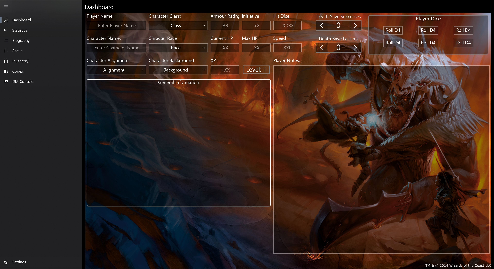
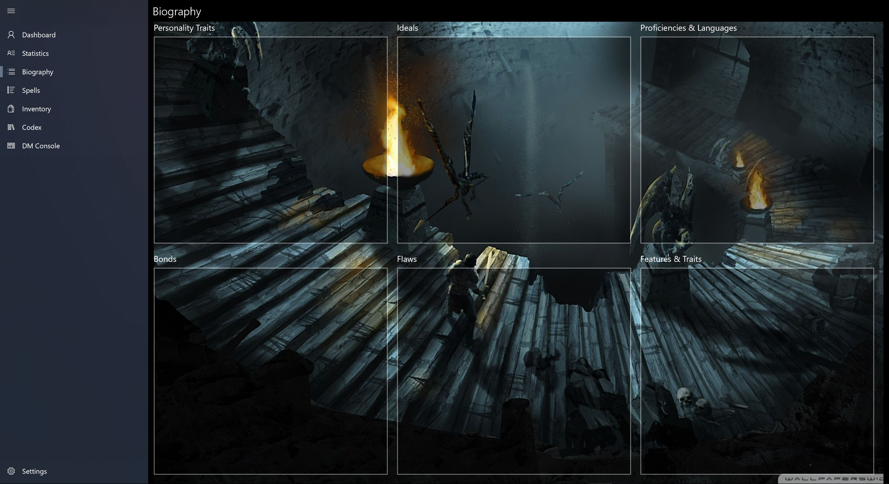
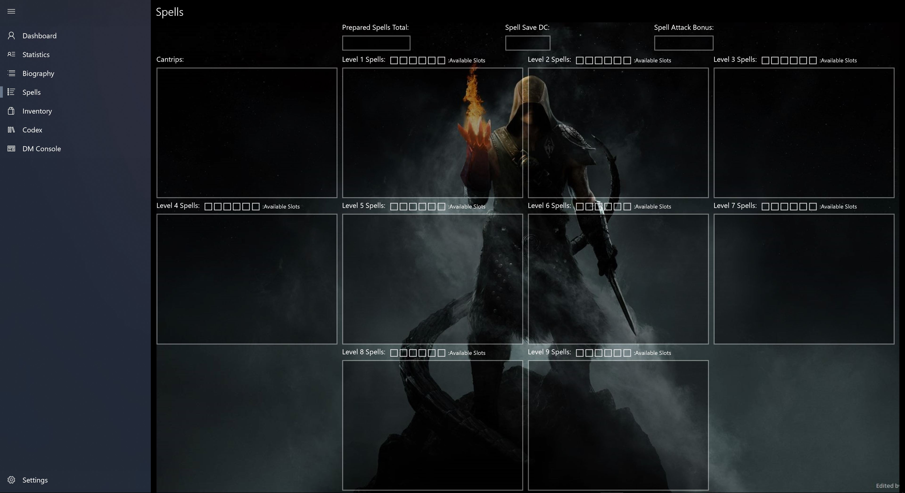
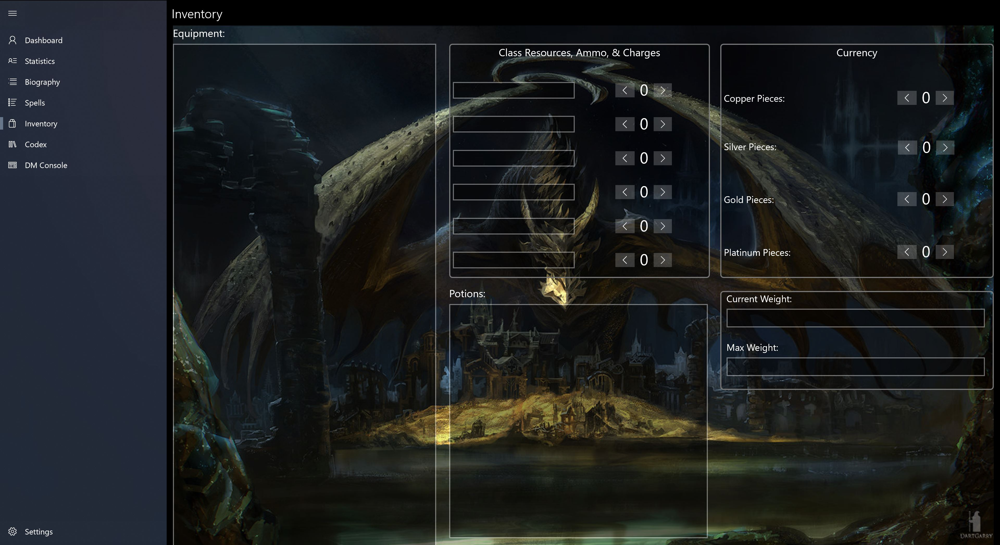
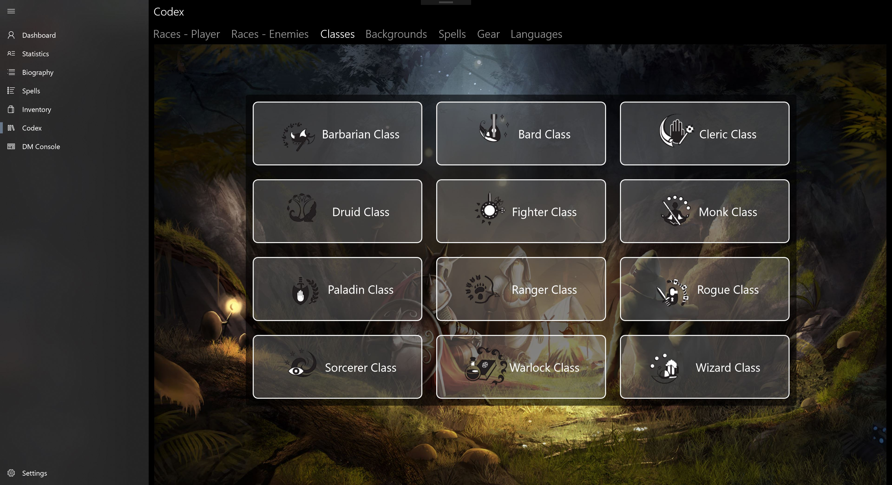
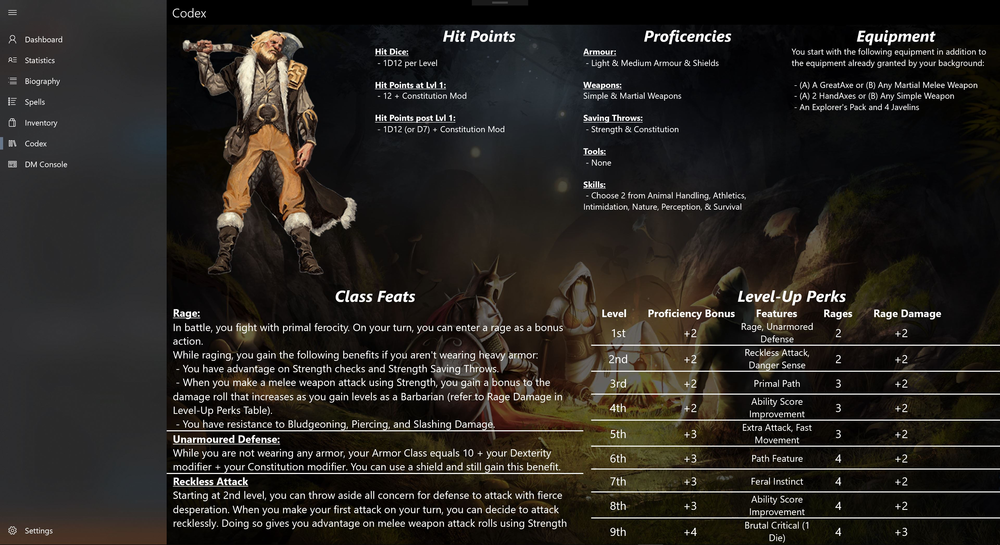

# D&D Desktop Companion
**DISCLAIMER: All rights belong to Wizards of the Coast and I in no way am claiming ownership of their intellectual property**

## Overview
- [What is This?](#what-is-this)
  * [Why Create It?](#why-create-it)
- [What Can It Do?](#what-can-it-do)
  * [Character Management](#character-management)
  * [Player Codex](#player-codex)
  * [DM Console](#dm-console)
- [Installation](#installation)
- [Contributions](#contributions)
- [Credits](#credits)
## What is This?
This project is a UWP-based utility for Dungeons & Dragons to help players manage their character(s), have easy access to handbook content, and give Dungeon Masters a utility through which they can manage their campaigns.
### Why Create It?
While being a novice D&D player and playing the game with my group, we came to the realization that having to manage characters using either pen/pencil and paper or editable PDF's, while simple initially, can become rather tedious. Hence my resolve to make the free utility for players both new and experienced that is easily accessible.
## What Can It Do?
The app itself is broken down into 3 primary sections: **Character Management**, a **Player Codex** for key aspects of D&D, and a **DM Console**.
### Character Management:
- General Character Properties:
  + View Health, Race, Class, Background, etc
  + Manage player notes
  + Keep track of death save successes and failures
  + Dice rolling module (optional to real dice of course)
  + General information module to summarize the overall significance of all stats and what they mean for your character
  
  
  
- Character Biography:
  + Flaws
  + Motivations
  + etc
  
  
  
- Skill Levels & Specializations:
  + Keep track of which stat-specific perks your character has
  + Indicates respective skill modifier based on base skill level

- Spell Management:
  + See and manage available spells slots at each level
  + Manage cantrips

- Inventory & Item Management:
  + Manage different currency amounts (CP, SP, GP, PP, etc)
  + Consumables (e.g. # of torches, health potions)
  + Resources (e.g. food rations)
 

### Player Codex:
- Different Races within D&D:
  + Player Races
  + Enemy Races
- Player Classes
- Player Backgrounds
- Spells
- Gear:
  + Armour
  + Weapons
  + Items
  + Consumables
- Languages of D&D

### DM Console:
- Story Campaigns
- Creature Manual
- Weapons, Items, & consumables
- Story Progression Tips
## Installation
Non-IDE installation instructions coming soon.
## Contributions
More content is always being added to and updated within the app, so If you'd like to see something game-related or feature-related to be integrated into future releases of the app, simply submit an issue ticket with the proper documentation with your request for approval!
## Credits
As always, credit goes to Wizards of the Coast for all D&D content.
